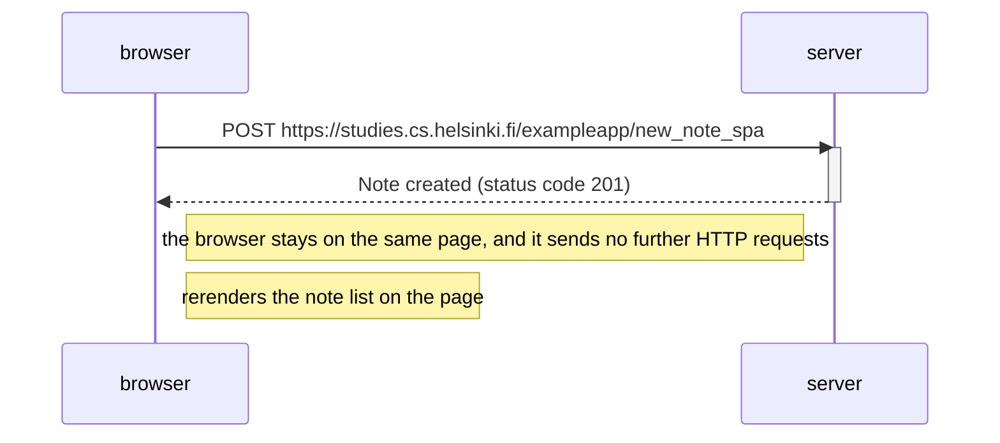

```mermaid
sequenceDiagram
    participant browser
    participant server

    browser->>server: POST https://studies.cs.helsinki.fi/exampleapp/new_note_spa
    activate server

    server-->>browser: Note created (status code 201)
    deactivate server

    Note right of browser: the browser stays on the same page, and it sends no further HTTP requests
    Note right of browser: rerenders the note list on the page
```