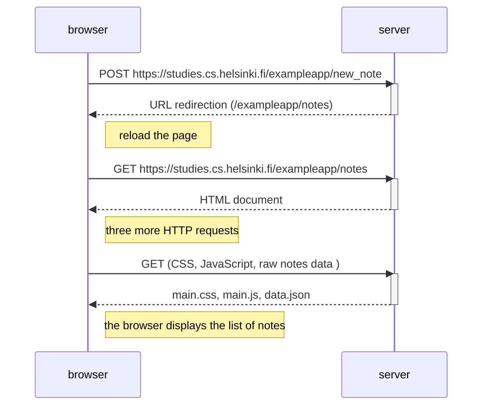

```mermaid
sequenceDiagram
    participant browser
    participant server

    browser->>server: POST https://studies.cs.helsinki.fi/exampleapp/new_note
    activate server

    server-->>browser: URL redirection (/exampleapp/notes)
    deactivate server

    Note right of browser: reload the page

    browser->>server: GET https://studies.cs.helsinki.fi/exampleapp/notes
    activate server

    server-->>browser: HTML document
    deactivate server

    Note right of browser: three more HTTP requests

    browser->>server: GET (CSS, JavaScript, raw notes data )
    activate server
    
    server-->>browser: main.css, main.js, data.json
    deactivate server

    Note right of browser: the browser displays the list of notes
```
